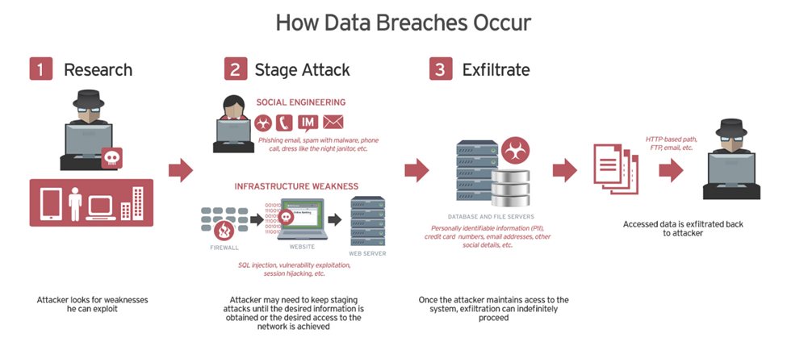

# Network Breach Case Study Research Paper

## Introduction

In today's world, network security is of critical importance for both companies and individuals to protect their digital assets. With the rapid advancement of digital transformation, the security and privacy of data are becoming increasingly concerning. Especially as organizations grapple with the rise in cyber threats, they must continuously update and strengthen their network security plans. In this context, researching, updating, and examining real-life scenarios are important steps for more effective combat against current threats.

Preventive approaches should be adopted, and security vulnerabilities should be addressed. Examining real-life network breach case studies is important for translating theoretical knowledge into practice and evaluating the effectiveness of network security strategies. These studies can help organizations and individuals understand how to respond to current threats and take appropriate security measures. Studying real-world scenarios can provide valuable insights for preventing future attacks.
In this paper, an analysis of a network breach case study will be conducted. The latest network breach or cyber attack case study selected from a reliable source will be examined.

## What is Network Breach?

A data breach is any security incident where an unauthorized individual gains access to personal (Social Security numbers, bank account numbers, health information) or corporate (customer records, financial information, intellectual property) data.

## What are Network Security Strategies?

Organizations support their network security strategy with various methods to protect their digital assets. These strategies include continuous monitoring and incident response, regular software updates and patch management, strong security firewalls, robust authentication protocols, data encryption, staff training and awareness programs, intrusion detection and prevention systems, AI-supported security, integration of threat intelligence, and secure web gateway entries. These methods are used to ensure network security and establish a resilient defense against cyber threats.

Boyner Store Anonymous Company’s  Network Breach Case Analysis 

### Attack Vector and Exploited Security Vulnerabilities

The data breach at Boyner Store Anonymous Company occurred due to its use of messaging services for bulk SMS and MMS communication for commercial purposes. Starting from April 28, 2023, attackers gained access to the company's SMS sending service provider and obtained personal data of specific customers, subsequently sending unauthorized SMS messages using this data. The attack began suspiciously with unauthorized access to the SMS Sending Panel and continued with various suspicious entries until May 6, 2023. During this period, attackers accessed the contact information of 2,313,962 customers and their personal information through SMS messages directing them to a fake website imitating Media Markt, involving 534,605 customers. It was determined that the perpetrators of the attack gained unauthorized access to the systems of the company's SMS sending service provider. As a result of this access, the attackers accessed customer contact information and other personal data from the company's databases and used this data for malicious purposes. During the attack process, the security vulnerabilities and weaknesses of the company provided opportunities for the attackers, leading to the success of the attack. Among these security vulnerabilities were factors such as weak authentication in accessing the SMS Sending Panel, insufficient network security measures, and lack of database protection.

### The Impact of the Influencing Organization on Network Security

The data breach experienced by Boyner Store Anonymous Company has had a significant impact on the organization's network security. The attack targeted the bulk SMS and MMS messaging services used by the company for commercial communication. Unauthorized access to the company's SMS Sending Panel and the failure to detect this access for almost ten days can be attributed to weaknesses in the company's network security infrastructure. This indicates that the company's network security policies and monitoring mechanisms may have been inadequate. As a result of the breach, the contact information of millions of customers and some of their personal data fell into the hands of the attackers. This demonstrates Boyner's weakness in protecting customer data and the inadequacy of its network security measures. The ability of the attackers to gain access to the network and reach sensitive data highlights the inadequacy of the company's network security policies and security measures.

This incident exposes the deficiencies in Boyner's network security strategy. The company may need to review its steps such as strengthening its network security infrastructure, implementing stronger authentication and access controls, conducting regular security audits, and establishing a more effective monitoring and alarm system for rapidly detecting security incidents. Additionally, employee training and awareness-building on security matters are crucial factors in enhancing network security.
This data breach has damaged Boyner's reputation and customer trust. The company may need to take serious measures to address weaknesses in protecting customer data and ensuring network security. Continuous effort is required to prevent such data breaches from recurring and to strengthen the company's network security.

### Boyner's Data security and Control

Boyner Store Anonymous Company swiftly implemented intervention strategies after detecting the data breach. Here are some of these strategies:

**Rapid Response to the Attack:** The company took immediate action upon detecting the data breach and implemented necessary measures to mitigate the attack. This step aimed to prevent the spread of the attack and further damage.

**Informing Customers:** In an effort to regain the trust of affected customers and keep them informed, the company adopted a clear and transparent communication strategy regarding the data breach. Customers were provided with accurate information about the situation, raising awareness about potential risks and the measures taken.

**Enhancement of Security Measures:** The company strengthened security measures to prevent similar data breaches and better prepare for future attacks. Steps taken included enhancing network security infrastructure, updating security software, and reviewing security policies.

**Collaboration:** Boyner collaborated with cybersecurity experts and institutions to deal with the data breach and identify its source. This collaboration led to gaining more information about the origin of the attack and the identities of the attackers, enabling the formulation of an effective intervention strategy.

**Legal Processes:** The company initiated legal processes related to the data breach and made necessary legal notifications. This step is crucial for ensuring compliance with data protection laws and preventing potential penalties.

**Public Disclosure:** By informing the public about the data breach, Boyner adhered to the principle of transparency and aimed to alleviate concerns of affected parties. This is an important strategy for maintaining the company's reputation and regaining customer trust.

These intervention strategies enabled Boyner to effectively navigate the process of dealing with the data breach and helped the company overcome the crisis with minimal damage.

### Improvements or Alternative Approaches to Prevent Similar Incidents in the Future

**Strengthening Security Infrastructure:** The company should reinforce its network security infrastructure and enhance security measures.

**Increasing Staff Training and Awareness:** Regular security training should be provided to employees to raise awareness.

**Risk Assessment and Emergency Plans:** Risk assessment should be conducted, and emergency plans should be developed.

**Continuous Improvement of Security Software:** Security software used should be regularly updated and improved.

**Leakage Monitoring and Early Warning Systems:** Leakage monitoring and early warning systems should be established in networks and systems.

**Review of External Supplier Relationships:** Relationships with external suppliers should be reviewed, and security standards should be determined.

#### References

[1] https://www.ibm.com/topics/data-breach

[2] https://www.linkedin.com/pulse/best-network-security-strategies-dan-duran-113cc

[3]https://www.kvkk.gov.tr/Icerik/7610/Kamuoyu-Duyurusu-Veri-Ihlali-Bildirimi-Boyner-Buyuk-Magazacilik-Anonim-Sirketi

[4]https://www.ngn.com.tr/en/media/success-stories/retail-giant-boyner-group-ensures-full-security-on-its-database-platforms-with-ngn/

[5]https://shiftdelete.net/boynerden-veri-sizintisi-aciklamasi
